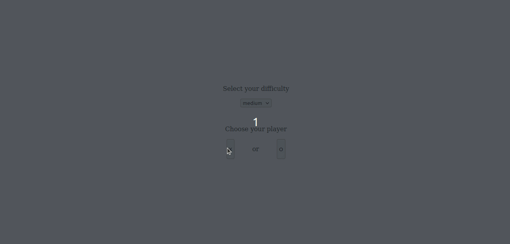

# Tic Tac Toe using React and typescript

**Link to project:** https://nebulahh.github.io/tic-tac-toe-react-typescript/

## How It's Made:

**Tech used:** React, Typescript, style-component and react modal

In this web application, users can play only against the computer and they can change the games difficulty. The computer plays are implemented with the minimax algorithm which is mostly used for games. Rhe modal will pop-up after the game end and the user is promted whether to start a new game. I did not seek to create a compelling UI but to become familiar with the tech stack and the minimax algorithm 

## Optimizations

The UI

## Lessons Learned:
Typescript, Minimax algorithm and styled-components
